.. _Python_CheatSheets:

Python Cheatsheets
===========================================================

Python Basic
~~~~~~~~~~~~~~~~~~~~~~~~
Source : `http://datasciencefree.com/python.pdf <http://datasciencefree.com/python.pdf>`_ 

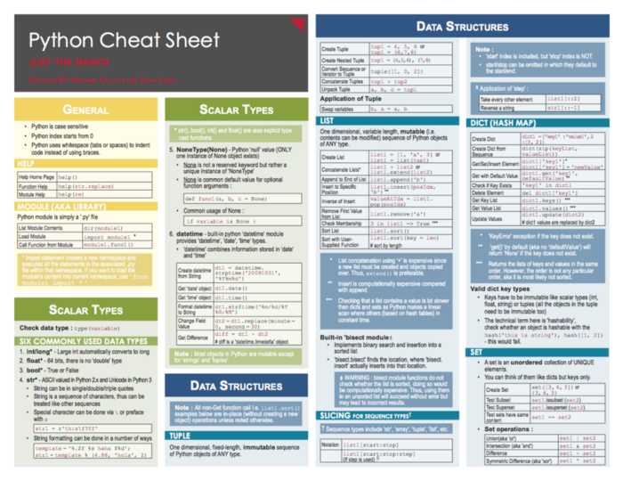

Source : `https://miro.medium.com/max/700/1*2Z6_OZGupydHyEajtQE0Gg.png <https://miro.medium.com/max/700/1*2Z6_OZGupydHyEajtQE0Gg.png>`_ 

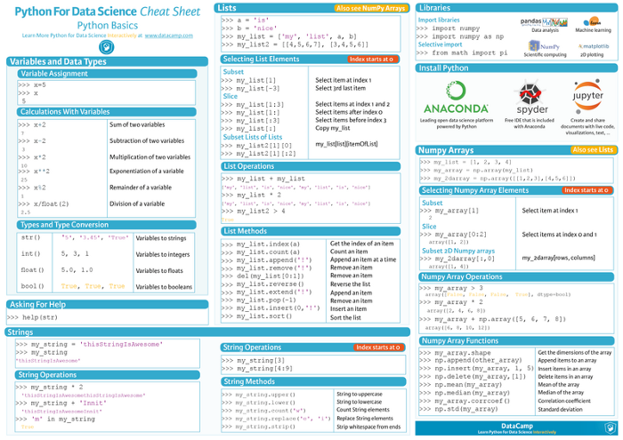
 

Numpy
~~~~~~~~~~~~~~~~~~~~~~~~
Source : `https://www.dataquest.io/blog/numpy-cheat-sheet/ <https://www.dataquest.io/blog/numpy-cheat-sheet/>`_ 

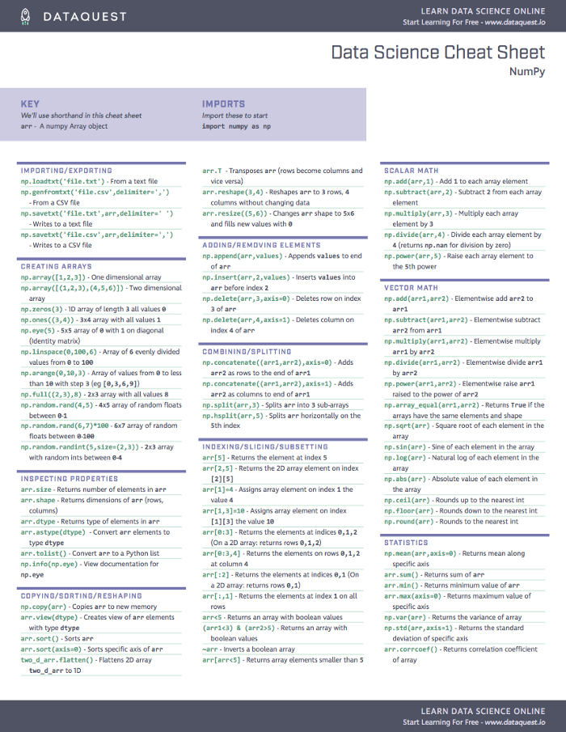

Source : `http://datasciencefree.com/numpy.pdf <http://datasciencefree.com/numpy.pdf>`_ 

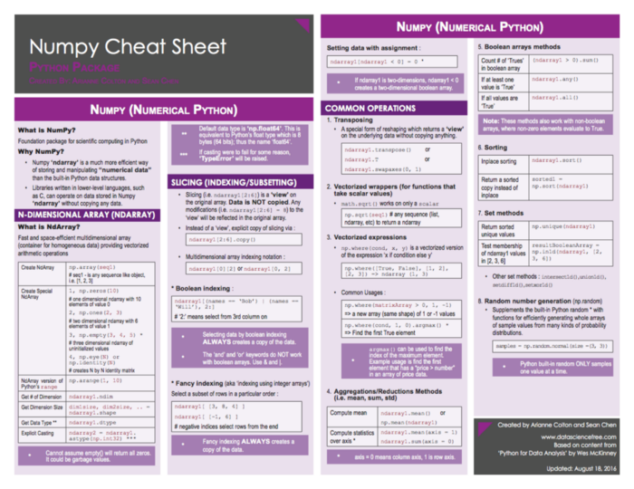

Source : `https://www.datacamp.com/community/blog/python-numpy-cheat-sheet#gs.Nw3V6CE <https://www.datacamp.com/community/blog/python-numpy-cheat-sheet#gs.Nw3V6CE>`_ 

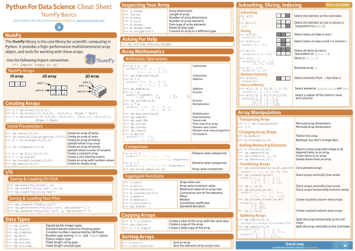

Pandas
~~~~~~~~~~~~~~~~~~~~~~~~
Source : `http://datasciencefree.com/pandas.pdf <http://datasciencefree.com/pandas.pdf>`_ 

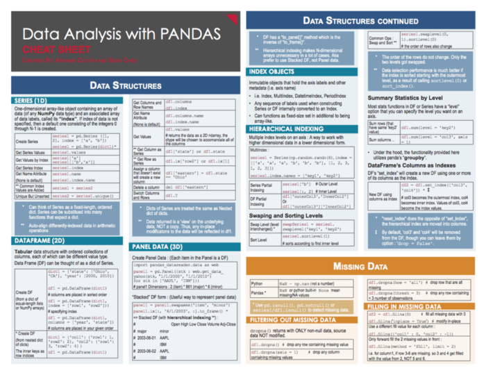

Source : `https://www.datacamp.com/community/blog/python-pandas-cheat-sheet#gs.S4P4T=U <https://www.datacamp.com/community/blog/python-pandas-cheat-sheet#gs.S4P4T=U>`_ 

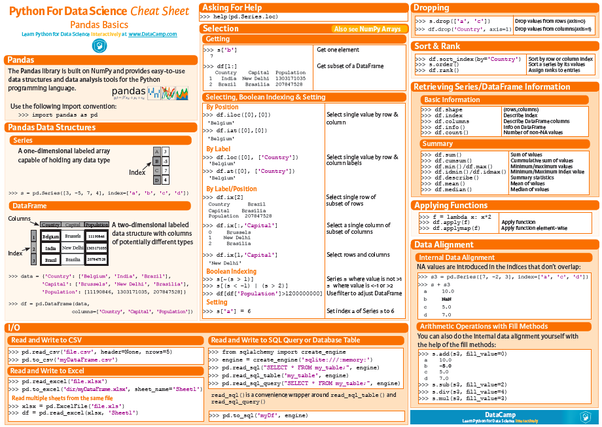

Matplotlib
~~~~~~~~~~~~~~~~~~~~~~~~
Source : `https://www.datacamp.com/community/blog/python-matplotlib-cheat-sheet <https://www.datacamp.com/community/blog/python-matplotlib-cheat-sheet>`_ 

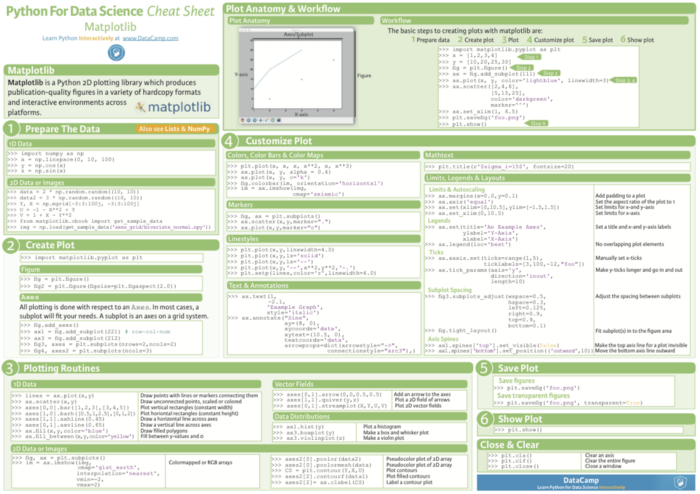

Scikit
~~~~~~~~~~~~~~~~~~~~~~~~
Source : `https://www.datacamp.com/community/blog/scikit-learn-cheat-sheet#gs.fZ2A1Jk <https://www.datacamp.com/community/blog/scikit-learn-cheat-sheet#gs.fZ2A1Jk>`_ 

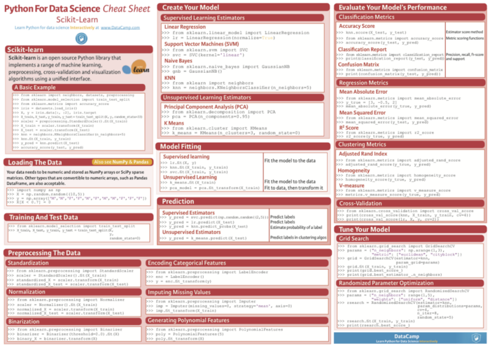

Source : `http://peekaboo-vision.blogspot.de/2013/01/machine-learning-cheat-sheet-for-scikit.html <http://peekaboo-vision.blogspot.de/2013/01/machine-learning-cheat-sheet-for-scikit.html>`_ 

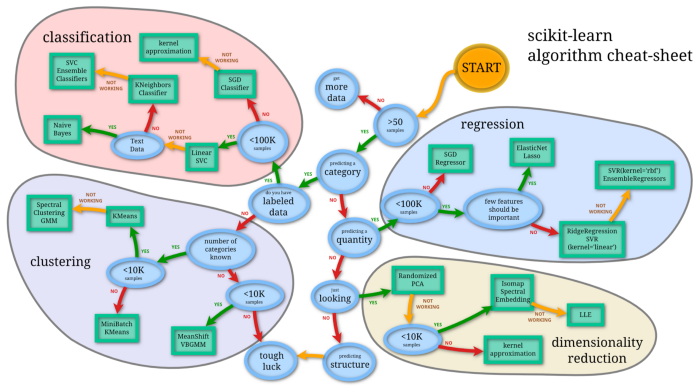

Tensorflow
~~~~~~~~~~~~~~~~~~~~~~~~
Source : `https://www.kaggle.com/getting-started/134439 <https://www.kaggle.com/getting-started/134439>`_ 

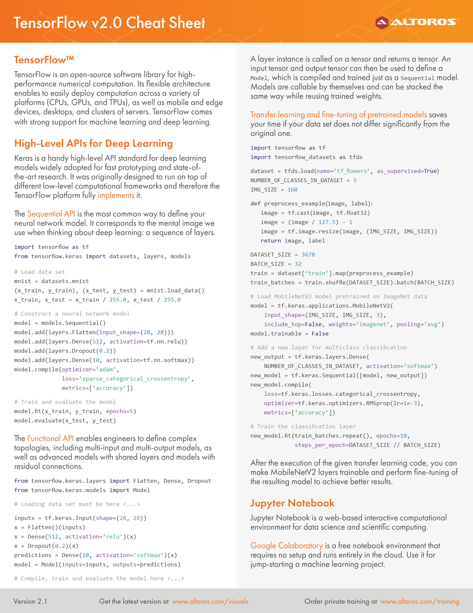

Probability
~~~~~~~~~~~~~~~~~~~~~~~~
Source : `http://www.wzchen.com/s/probability_cheatsheet.pdf <http://www.wzchen.com/s/probability_cheatsheet.pdf>`_ 

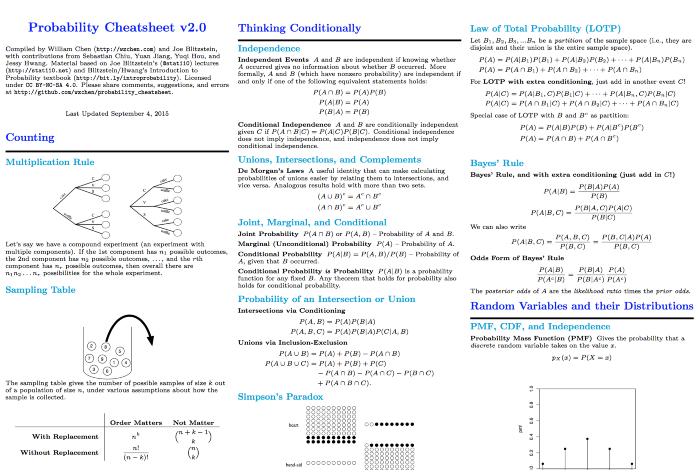

Linear Algebra
~~~~~~~~~~~~~~~~~~~~~~~~
Source : https://minireference.com/static/tutorials/linear_algebra_in_4_pages.pdf <https://minireference.com/static/tutorials/linear_algebra_in_4_pages.pdf`_ 

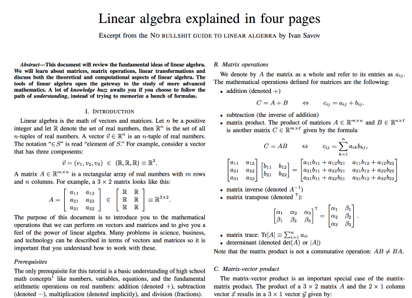

Calculus
~~~~~~~~~~~~~~~~~~~~~~~~
Source : `http://tutorial.math.lamar.edu/getfile.aspx?file=B,41,N <http://tutorial.math.lamar.edu/getfile.aspx?file=B,41,N>`_ 

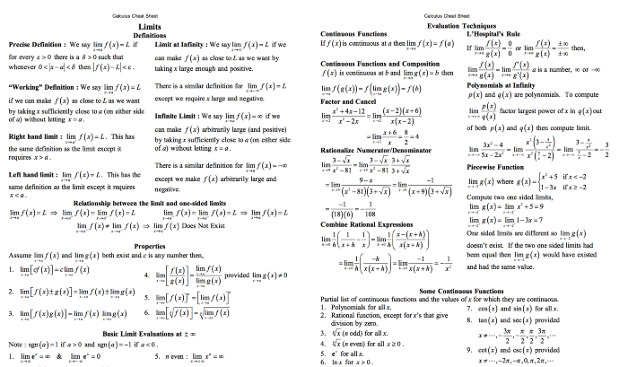

Statistics
~~~~~~~~~~~~~~~~~~~~~~~~
Source : `http://web.mit.edu/~csvoss/Public/usabo/stats_handout.pdf <http://web.mit.edu/~csvoss/Public/usabo/stats_handout.pdf>`_ 

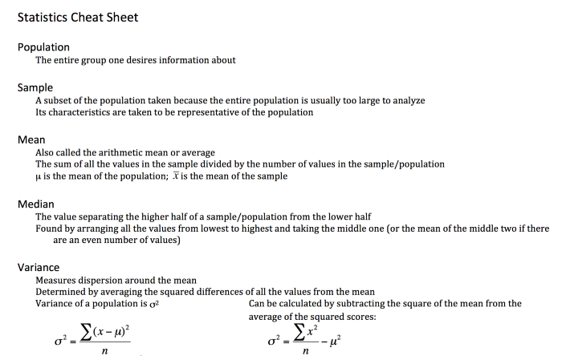