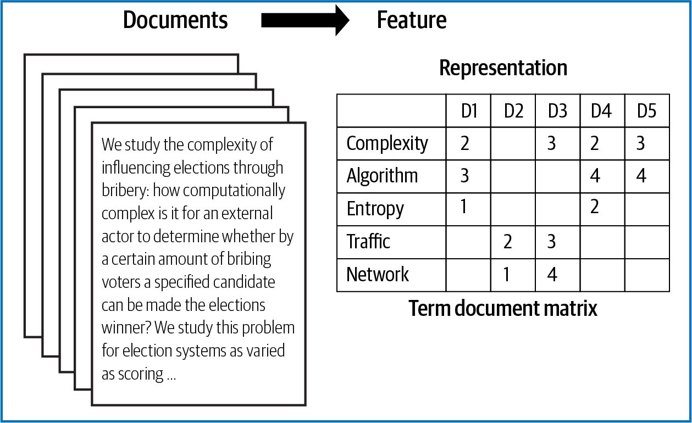

.. _feature_representation:

Feature Representation
========================

| **Feature Representation**

| The vast majority of NLP-related data, such as news feed articles, PDF reports, social media posts, and audio files, is created for human consumption. As such, it is often stored in an unstructured format, which cannot be readily processed by computers.   In order for the preprocessed information to be conveyed to the statistical inference algorithm, the tokens need to be translated into predictive features. A model is used  to embed raw text into a vector space.

| Feature representation involves two things:
| A vocabulary of known words.
| A measure of the presence of known words. Some of the feature representation methods are:
|  1. Bag of words
|  2. TF-IDF
|  3. Word embedding

* Pretrained models (e.g., word2vec, GloVe, spaCy’s word embedding model)
* Customized deep learning–based feature representation 

| Let’s learn more about each of these methods.
|
| **Bag of words—word count**
| In natural language processing, a common technique for extracting features from text is to place all words that occur in the text in a bucket. This approach is called a bag of words model. It’s referred to as a bag of words because any information about the structure of the sentence is lost. In this technique, we build a single matrix from a collection of texts, as shown in Figure 10-4, in which each row represents a token and each column represents a document or sentence in our corpus. The values of the matrix represent the count of the number of instances of the token appearing.

A customized deep learning–based feature representation model is built in case study 1 of this chapter.

| *Figure 10-4.* Bag of words
| The CountVectorizer from sklearn provides a simple way to both tokenize a collec‐ tion of text documents and encode new documents using that vocabulary. The fit_transform function learns the vocabulary from one or more documents and encodes each document in the word as a vector:

.. code-block:: python

  sentences = [
  'The stock price of google jumps on the earning data today', 'Google plunge on China Data!'
  ]
  from sklearn.feature_extraction.text import CountVectorizer vectorizer = CountVectorizer()
  print( vectorizer.fit_transform(sentences).todense() ) print( vectorizer.vocabulary_ )

| **Output**
| [[0 1 1 1 1 1 1 0 1 1 2 1]
| [1 1 0 1 0 0 1 1 0 0 0 0]]
| {'the': 10, 'stock': 9, 'price': 8, 'of': 5, 'google': 3, 'jumps':\
| 4, 'on': 6, 'earning': 2, 'data': 1, 'today': 11, 'plunge': 7,\
| 'china': 0}
| We can see an array version of the encoded vector showing a count of one occurrence for each word except the (index 10), which has an occurrence of two. Word counts are a good starting point, but they are very basic. One issue with simple counts is that some words like the will appear many times, and their large counts will not be very meaningful in the encoded vectors. These bag of words representations are sparse because the vocabularies are vast, and a given word or document would be repre‐ sented by a large vector comprised mostly of zero values.

| **TF-IDF**
| An alternative is to calculate word frequencies, and by far the most popular method for that is TF-IDF, which stands for Term Frequency–Inverse Document Frequency:
| **Term Frequency**
| This summarizes how often a given word appears within a document.
| **Inverse Document Frequency**
| This downscales words that appear a lot across documents.

Put simply, TF-IDF is a word frequency score that tries to highlight words that are more interesting (i.e., frequent within a document, but not across documents). The TfidfVectorizer will tokenize documents, learn the vocabulary and the inverse docu‐ ment frequency weightings, and allow you to encode new documents:

.. code-block:: python

  from sklearn.feature_extraction.text import TfidfVectorizer vectorizer = TfidfVectorizer(max_features=1000, stop_words='english') TFIDF = vectorizer.fit_transform(sentences) print(vectorizer.get_feature_names()[-10:])
  print(TFIDF.shape) print(TFIDF.toarray())

| **Output**
| ['china', 'data', 'earning', 'google', 'jumps', 'plunge', 'price', 'stock', \ 'today']
| (2, 9)
| [[0.	0.29017021 0.4078241 0.29017021 0.4078241 0.
| 0.4078241 0.4078241 0.4078241 ]
| [0.57615236 0.40993715 0.	0.40993715 0.	0.57615236
| 0.	0.	0.	]]

| In the provided code snippet, a vocabulary of nine words is learned from the docu‐  ments. Each word is assigned a unique integer index in the output vector. The sen‐ tences are encoded as a nine-element sparse array, and we can review the final scorings of each word with different values from the other words in the vocabulary.
| **Word embedding**

| A word embedding represents words and documents using a dense vector representa‐ tion. In an embedding, words are represented by dense vectors in which a vector rep‐ resents the projection of the word into a continuous vector space. The position of a word within the vector space is learned from text and is based on the words that sur‐ round the word when it is used. The position of a word in the learned vector space is referred to as its embedding.
| Some of the models of learning word embeddings from text include word2Vec, spaCy’s pretrained word embedding model, and GloVe. In addition to these carefully designed methods, a word embedding can be learned as part of a deep learning model. This can be a slower approach, but it tailors the model to a specific training dataset.

| **Pretrained model: Via spaCy**
| spaCy comes with built-in representation of text as vectors at different levels of word, sentence, and document. The underlying vector representations come from a word embedding model, which generally produces a dense, multidimensional semantic representation of words (as shown in the following example). The word embedding model includes 20,000 unique vectors with 300 dimensions. Using this vector repre‐ sentation, we can calculate similarities and dissimilarities between tokens, named entities, noun phrases, sentences, and documents.
| The word embedding in spaCy is performed by first loading the model and then pro‐ cessing text. The vectors can be accessed directly using the .vector attribute of each processed token (i.e., word). The mean vector for the entire sentence is also calcula‐ ted simply by using the vector, providing a very convenient input for machine learn‐ ing models based on sentences:

.. code-block:: python

  doc = nlp("Apple orange cats dogs")
  print("Vector representation of the sentence for first 10 features: \n", \ doc.vector[0:10])

| **Output:**
| Vector representation of the sentence for first 10 features: 
| [ -0.30732775 0.22351399 -0.110111	-0.367025	-0.13430001 0.13790375 -0.24379876 -0.10736975  0.2715925	1.3117325 ]
| The vector representation of the sentence for the first 10 features of the pretrained model is shown in the output.
| **Pretrained model: Word2Vec using gensim package**
| The Python-based implementation of the word2vec model using the gensim package is demonstrated here:

.. code-block:: python

  rom gensim.models import Word2Vec
  sentences = [
  ['The','stock','price', 'of', 'Google', 'increases'],
  ['Google','plunge',' on','China',' Data!']]
  # train model
  model = Word2Vec(sentences, min_count=1)
  # summarize the loaded model words = list(model.wv.vocab) print(words) print(model['Google'][1:5])

| **Output**
| ['The', 'stock', 'price', 'of', 'Google', 'increases', 'plunge', ' on', 'China',\ ' Data!']
| [-1.7868265e-03 -7.6242397e-04 6.0105987e-05 3.5568199e-03
| ]
| The vector representation of the sentence for the first five features of the pretrained word2vec model is shown above.
