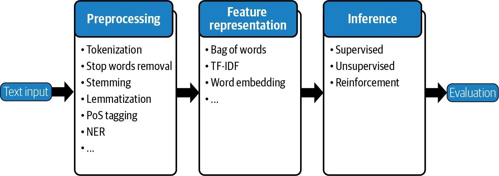
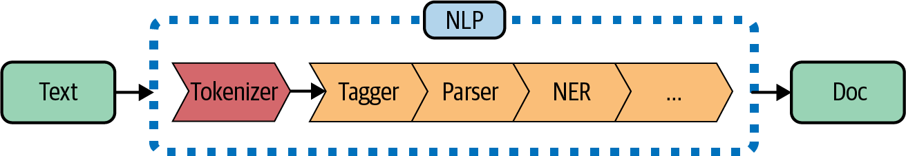

.. _preprocessing:

Preprocessing
================

There are usually multiple steps involved in preprocessing textual data for NLP. Figure 10-1 shows the key components of the preprocessing steps for NLP. These are tokenization, stop words removal, stemming, lemmatization, PoS (part-of-speech) tagging, and NER (Name Entity Recognition).

Figure 10-1. Natural language processing pipeline

**Tokenization**

Tokenization is the task of splitting a text into meaningful segments, called tokens. These segments could be words, punctuation, numbers, or other special characters that are the building blocks of a sentence. A set of predetermined rules allows us to effectively convert a sentence into a list of tokens. The following code snippets show sample word tokenization using the NLTK and TextBlob packages:

.. code-block:: python

   # Text to tokenize
   text = "This is a tokenize test"
   The NLTK data package includes a pretrained Punkt tokenizer for English, which was previously loaded:
   from nltk.tokenize import word_tokenize word_tokenize(text)

Output : 
   ['This', 'is', 'a', 'tokenize', 'test']

   Let’s look at tokenization using TextBlob:
   
TextBlob(text).words
Output
WordList(['This', 'is', 'a', 'tokenize', 'test'])

**Stop words removal**

At times, extremely common words that offer little value in modeling are excluded from the vocabulary. These words are called stop words. The code for removing stop words using the NLTK library is shown below:
text = "S&P and NASDAQ are the two most popular indices in US"

.. code-block:: python

   from nltk.corpus import stopwords
   from nltk.tokenize import word_tokenize stop_words = set(stopwords.words('english')) text_tokens = word_tokenize(text)

   tokens_without_sw= [word for word in text_tokens if not word in stop_words]

   print(tokens_without_sw)

**Output**

['S', '&', 'P', 'NASDAQ', 'two', 'popular', 'indices', 'US']

We first load the language model and store it in the stop words variable. The stop words.words('english') is a set of default stop words for the English language model in NLTK. Next, we simply iterate through each word in the input text, and if the word exists in the stop word set of the NLTK language model, the word is removed. As we can see, stop words, such as are and most, are removed from the sen‐ tence.

**Stemming**

Stemming is the process of reducing inflected (or sometimes derived) words to their stem, base, or root form (generally a written word form). For example, if we were to stem the words Stems, Stemming, Stemmed, and Stemitization, the result would be a single word: Stem. The code for stemming using the NLTK library is shown here:

.. code-block:: python

   text = "It's a Stemming testing" 
   parsed_text = word_tokenize(text)
   # Initialize stemmer.
   from nltk.stem.snowball import SnowballStemmer stemmer = SnowballStemmer('english')

   # Stem each word.
   [(word, stemmer.stem(word)) for i, word in enumerate(parsed_text)
   if word.lower() != stemmer.stem(parsed_text[i])]

**Output**

[('Stemming', 'stem'), ('testing', 'test')]

**Lemmatization**

A slight variant of stemming is lemmatization. The major difference between the two processes is that stemming can often create nonexistent words, whereas lemmas are actual words. An example of lemmatization is run as a base form for words like run‐ ning and ran, or that the words better and good are considered the same lemma. The code for lemmatization using the TextBlob library is shown below:

.. code-block:: python

   text = "This world has a lot of faces "

   from textblob import Word parsed_data= TextBlob(text).words

   [(word, word.lemmatize()) for i, word in enumerate(parsed_data)
   if word != parsed_data[i].lemmatize()]

**Output**

[('has', 'ha'), ('faces', 'face')]

**PoS tagging**

Part-of-speech (PoS) tagging is the process of assigning a token to its grammatical cat‐ egory (e.g., verb, noun, etc.) in order to understand its role within a sentence. PoS   tags have been used for a variety of NLP tasks and are extremely useful since they provide a linguistic signal of how a word is being used within the scope of a phrase, sentence, or document.
After a sentence is split into tokens, a tagger, or PoS tagger, is used to assign each token to a part-of-speech category. Historically, hidden Markov models (HMM) were used to create such taggers. More recently, artificial neural networks have been lever‐ aged. The code for PoS tagging using the TextBlob library is shown here:

.. code-block:: python

   text = 'Google is looking at buying U.K. startup for $1 billion' 
   TextBlob(text).tags

**Output**

| [('Google', 'NNP'),
| ('is', 'VBZ'),
| ('looking', 'VBG'),
| ('at', 'IN'),
| ('buying', 'VBG'),
| ('U.K.', 'NNP'),
| ('startup', 'NN'),
| ('for', 'IN'),
| ('1', 'CD'),
| ('billion', 'CD')]

| **Named entity recognition**
| Named entity recognition (NER) is an optional next step in data preprocessing that seeks to locate and classify named entities in text into predefined categories. These  categories can include names of persons, organizations, locations, expressions of times, quantities, monetary values, or percentages. The NER performed using spaCy  is shown below:

.. code-block:: python

   text = 'Google is looking at buying U.K. startup for $1 billion'
   for entity in nlp(text).ents: print("Entity: ", entity.text)

| **Output**
| Entity: Google Entity: U.K. Entity: $1 billion
| Visualizing named entities in text  using  the  displacy module,  as  shown  in  Figure 10-2, can also be incredibly helpful in speeding up development and debug‐  ging the code and training process:

.. code-block:: python

   from spacy import displacy
   displacy.render(nlp(text), style="ent", jupyter = True)

Figure 10-2. NER output

| **SpaCy** 
| All of the above steps in one go. All the preprocessing steps shown above can be performed in one step using spaCy. When we call nlp on a text, spaCy first tokeni‐ zes the text to produce a Doc object. The Doc is then processed in several different steps. This is also referred to as the processing pipeline. The pipeline used by the default models consists of a tagger, a parser, and an entity recognizer. Each pipeline component returns the processed Doc, which is then passed on to the next compo‐ nent, as demonstrated in Figure 10-3.

Figure 10-3. spaCy pipeline (based on an image from the spaCy website.

.. code-block:: python

   text = 'Google is looking at buying U.K. startup for $1 billion' 
   doc = nlp(text)
   pd.DataFrame([[t.text, t.is_stop, t.lemma_, t.pos_]
   for t in doc],
   columns=['Token', 'is_stop_word', 'lemma', 'POS'])

**Output**

| Token   is_stop_word  lemma POS	
| Google  False	Google PROPN
| is	True	be	VERB
| looking False	look	VERB
| at	True	at	ADP

| Token is_stop_word lemma POS    
| 4	buying
| False
| buy
| VERB
| 5	U.K.
| False
| U.K.
| PROPN
| 6	startup
| False
| startup
| NOUN
| 7	for
| True
| for
| ADP
| 8	$
| False
| $
| SYM
| 9	1
| False
| 1
| NUM
| 10 billion
| False
| billion
| NUM

| The output for each of the preprocessing steps is shown in the preceding table. Given that spaCy performs a wide range of NLP-related tasks in a single step, it is a highly recommended package. As such, we will be using spaCy extensively in our case studies.
| In addition to the above preprocessing steps, there are other frequently used prepro‐ cessing steps, such as lower casing or nonalphanumeric data removing, that we can perform depending on the type of data. For example, data scraped from a website has to be cleansed further, including the removal of HTML tags. Data from a PDF report must be converted into a text format.
| Other optional preprocessing steps include dependency parsing, coreference resolu‐ tion, triplet extraction, and relation extraction:

| **Dependency parsing**
| Assigns a syntactic structure to sentences to make sense of how the words in the sentence relate to each other.

| **Coreference resolution**
| The process of connecting tokens that represent the same entity. It is common in languages to introduce a subject with their name in one sentence and then refer  to them as him/her/it in subsequent sentences.

| **Triplet extraction**
| The process of recording subject, verb, and object triplets when available in the sentence structure.

| **Relation extraction**
| A broader form of triplet extraction in which entities can have multiple interactions.
